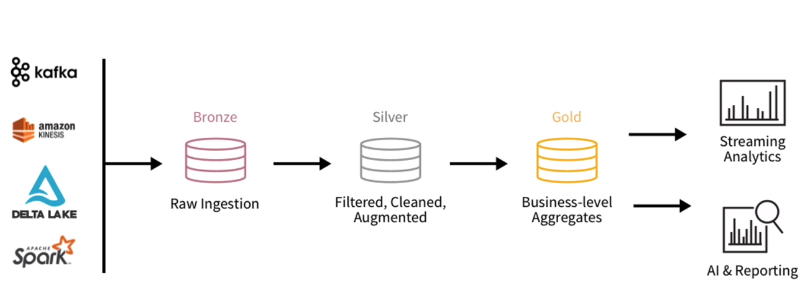
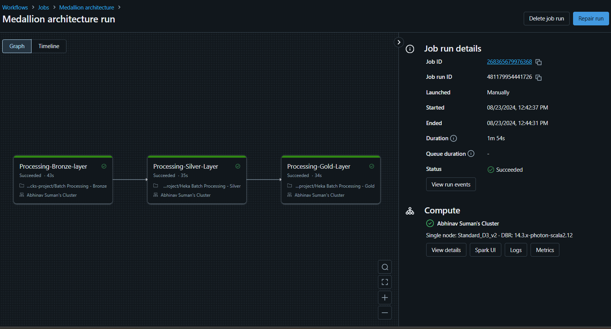

# Databricks Medallion Architecture Project

## Overview
This project implements the Medallion architecture using Databricks, focusing on batch processing of data at various stages: Bronze, Silver, and Gold.

## Files Included

1. **Batch Processing - Bronze.py**: 
   - **Purpose**: Handles raw data ingestion from various sources. Data is consumed in CSV format and stored in Parquet format for further processing.
   - **Key Steps**:
     - Set up the notebook environment.
     - Read and consolidate data from external sources.
     - Store the processed data in the Bronze layer.

2. **Batch Processing - Silver.py**:
   - **Purpose**: Cleanses and transforms data from the Bronze layer, preparing it for the Gold layer.
   - **Key Steps**:
     - Set up the notebook environment.
     - Read data from the Bronze layer.
     - Perform data cleansing and transformation.
     - Store the processed data in the Silver layer.

3. **Batch Processing - Gold.py**:
   - **Purpose**: Consumes data from the Silver layer, performs further transformations, and prepares it for data insights and visualization.
   - **Key Steps**:
     - Set up the notebook environment.
     - Read data from the Silver layer.
     - Transform data for insights.
     - Store the final data in the Gold layer.

## Dataset
The dataset used in this project contains various metrics related to memory usage and API calls in Android applications. It is stored in `dataset.csv` and is processed through the Bronze, Silver, and Gold layers.

## Images

### Medallion Architecture

### Databricks Workflow Run

## Purpose of the Project
The project aims to establish a structured approach to data processing using the Medallion architecture, which separates data into different layers based on quality and processing stage. This allows for efficient handling, storage, and retrieval in Databricks.

## Usage Instructions
To use the scripts, import them into a Databricks notebook environment and run them according to the desired data processing needs.

## Contribution
Feel free to contribute to the project by submitting a pull request or raising an issue.
